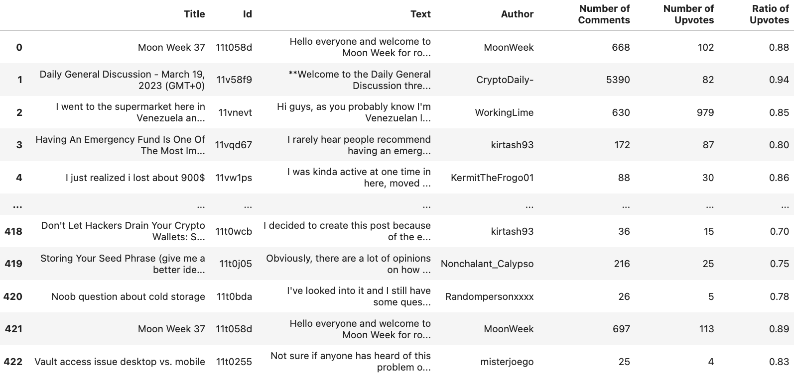
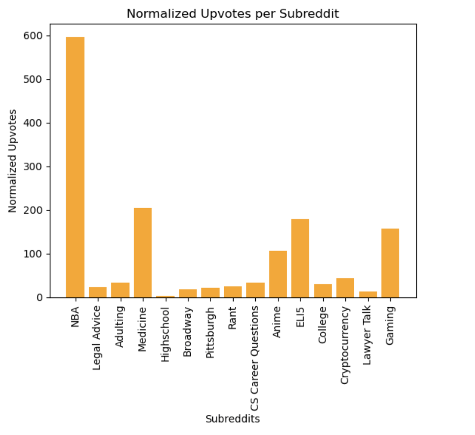

# Final Report - For Reddit Grammaticality Analysis

## Background

The internet's impact on human language is undeniable. One can see this impact through the use of abbreviations, internet slang, the use of emojis, overuse of punctuations, and abnormal capitalization patterns. Many people view this change negatively, commonly citing examples of bad grammar and spelling. However, an area of linguistics provides a more positive perspective on this change.

This area of linguistics is called internet linguistics. Internet linguistics is concerned with how language has changed due to online communication. Furthermore, this area of linguistics provides a perspective on why these changes should be as natural and positive. Specifically, Gretchen McCulloch cites that "Language is humanity's most spectacular open-source project" and that "There's not one right way to communicate"(McDonough, 2019).

With this perspective, I wanted to delve into the world of internet linguistics in my project. I wanted to explore the possibility of capturing, categorizing, and analyzing patterns of writing online. To do this, I turned my focus to Reddit, and online forum.

## Data

##### Dataset

I decided to collect all of the data for this project myself. Although Reddit datasets exist, collecting my own data gave me complete control over the subreddits that I collect from, how much data I collect, and the data that I collect from each subreddit. To collect the data, I decided to use PRAW, which stands for Python Reddit API Wrapper. This wrapper, with my Reddit API credentials, allowed me to easily parse subreddits and collect various aspects of posts.

Using PRAW, I collected posts from 15 different subreddits: r/nba, r/gaming, r/cryptocurrency, r/lawyertalk, r/legalAdvice, r/highschool, r/adulting, r/rant, r/pittsburgh, r/broadway, r/medicine, r/explainlikeimfive, r/college, r/anime, and r/cscareerquestions. I chose these subreddits as they all potentially contain different patterns of online writing. Within these subreddits, I collected a dataset of 1500 posts per subreddit. For each post, I also collected the title, the ID, the author, the text, the number of comments, the number of upvotes, and the upvote ratio. This data was packaged into .csv files. A part of one of the datasets, namely the cryptocurrency dataset, is shown below.

##### Annotation

This data was then annotated with language-tool-python, which is a Python wrapper for a widely-used grammar checker. Essentially, this tool would be used on all of the text for each subreddit. If an error was found, the tool would return the error with various details. If no error was found, it would return an empty list. These errors were kept in a list of lists for each subreddit. These lists were worked with for the majority of the analysis.

The data's grammaticality annotations came from language-tool-python, a Python wrapper for a widely-used grammar checker. Essentially, this tool took in the input of every post for every subreddit. If the tool detected no error, it returned an empty list. If the tool detected an error, it returned a list of errors with various details regarding the error. Most of the analysis focused on this list of errors for each subreddit.

## Analysis

##### Overview

For the analysis portion of my project, I focused on a series of questions. The overall analysis focused on, is there a way to categorize common grammatical errors? From this question, I explored three sub-questions: 

Which grammatical errors are most prevalent on Reddit? 
Are there grammatical errors that are more common across certain subreddits? 
Does the grammaticality of a post have an effect on its interactions?

##### Which grammatical errors are most prevalent on Reddit? 

In pursuit of the most prevalent grammatical errors, I iterated over the list of lists of errors for each subreddit. I kept a counter of each error for each subreddit to see if they existed within a subreddit and to see their commonality. After this iteration, I found that **MORFOLOGIK_RULE_EN_US** is the most common error in 12 out of 15 subreddits. In addition to this, it is the second most common error in three out of 15 subreddits. Overall, it made up about 73% of all errors in all subreddits combined. However, there are many issues with this error.

Although the tool did mark genuine spelling errors, such as writing "ione"  instead of "one", the tool marked many words that I did not consider to be an error. For example, the names of people, such as "Joel Embiid", showed up in an error. The names of applications, such as CarMax, also showed up in an error. Other incorrectly marked errors included shortened words, such as shortening "calculus" to "calc",  were considered to be an error. Finally, regional words, such as "yinzer", were viewed as an error. This proved to be an issue in my analysis, as they took up a large portion of errors yet they did not provide a lot of important insight regarding grammaticality. Therefore, I made the decision to remove **MORFOLOGIK_RULE_EN_US** from my analysis.

After removing the rule, the top rule in 11 out of 15 subreddits became **COMMA_COMPOUND_SENTENCE**. This rule also became the second top rule in four out of 15 subreddits. Essentially, this error is regarding the lack of a comma in a compound sentence. Run-on sentences are common in online communication. In an online setting, the first grammatical feature that. people tend to neglect is the comma, as people typically do not view it as important to the meaning of their sentence.

##### Are there grammatical errors that are more common across certain subreddits? 

To see which errors are more common across certain subreddits, I decided to explore which grammatical errors are unique to a certain subreddit. To do this, I found the difference between a specific subreddit's top errors and the the set of every subreddit's top errors. After doing this for every subreddit, I found that only four subreddits have a unique top error and no subreddit had more than one unique top error. In general, this demonstrates that there is some level of uniqueness to a subreddit's grammaticality that may set the writing style apart from other subreddits. It should be noted that these errors may occur in other subreddits as I only looked at top errors. However, it is both the uniqueness in comparison to other subreddits and the level of occurence within a subreddit that is looked at in this question of analysis.

The legal advice subreddit had **POSSESSIVE_APOSTROPHE** as a unique top error. This error is caused by a lack of possessive apostrophe. This may occur frequently due to the nature of the content of the posts, such that people ask for legal advice and often refer to their belongings with a possessive apostrophe.

 **EN_SPECIFIC_CASE** was a unique top error of the gaming subreddit. This error is regarding a lack of capitalization of proper nouns. This could be due to the fact that this subreddit contains a lot of titles of games that need to be capitalized.

The unique top of error of the explain like i'm five subreddit was **UNIT_SPACE**. This error is caused by a lack of space between a number and its unit.  The uniqueness of this error may be attributed to the fact there are many scientific questions that contain units in the subreddit.

The lawyer talk subreddit had **AM_I** as a unique top error. This error is caused by the lack of "I" before the word“am". I don't have a specific hypothesis for this one, but it is interesting that this error is so prevalent in this specific subreddit.

#####  Does the grammaticality of a post have an effect on its interactions?

In order to find the connection between interactions and grammaticality, I decided to first find the normalized counts of errors per post for each subreddit. One can see this visualized below.

In addition to finding the normalized counts per post for each subreddit, I also wanted to find the normalized counts of upvotes per post for each subreddit.  One can see this visualized below.

Taking these two measures into account, one can see that there is no real connection between interactions and grammaticality. Some subreddits had a high number of upvotes and a low number of errors, such as college subreddit. The inverse of this also exist, as seen in the cryptocurrency subreddit. This could be caused by many factors, such as the frequency of posts on that subreddit and the amount of users on that subreddit.

## Setbacks and Difficulties

Figuring out how to define and annotate grammaticality was a challenge. First, I considered annotating all of the posts by hand, but this was infeasible and subjective. I also considered creating my own grammaticality annotator, however this was a seemingly daunting and also subjective task. After all considerations, I decided to see if any existing grammaticality parsers existed, which is how I found and settled on language-tool-python.

Data collection and cleaning was a general difficulty during this project. This phase took much longer than expected and took away from some of the analysis that i had planned for this project. The data itself was large, therefore navigating it and running code over parts of it was very challenging. Specifically, writing and running code for 1500 posts per 15 subreddits took a large amount of time. This was especially true for parsing posts with language-tool-python, as determine the grammaticality of every sentence for every post in every subreddit was a very time-consuming task.

## Conclusion

This project, overall, provided a great exploration into internet linguistics for myself. I found a way to categorize grammatical errors, which proved to be a huge success in my analysis. I also believe that I found some level of evidence of grammatical differences between subreddits that may have different writing patterns. It was incredibly challenging at times, but also very rewarding to be able to look at all of the progress that has been made.  I learned so much about the process of data collection, organization, and analysis, that will prove to be useful to me beyond my college years.

## References

McDonough, M. (2019, July 29). Is the internet killing language? LOL, no. Vox. Retrieved April 27, 2023, from https://www.vox.com/the-highlight/2019/7/22/20702335/internet-language-text-emojis-gifs-bad-for-english 
